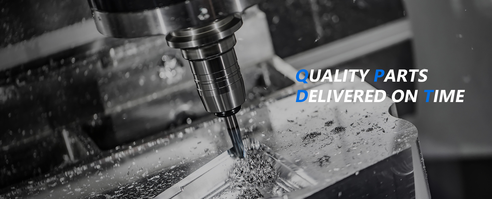
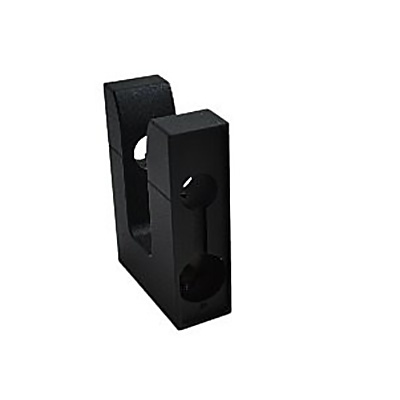

# YCT Precision - 元件使用說明文件 (Component Guide)

本文件說明 `YCT Precision` 頁面樣板中各個主要 UI 元件（Components）的結構、CSS 類別與依賴的 JavaScript 功能。開發者可透過複製對應的 HTML 結構來重複使用這些元件。

# 目錄
  - [1. 核心排版與容器 (Layout & Containers)](#1-核心排版與容器-layout--containers)
    - [Custom Container](#custom-container)
  - [2. 導覽列元件 (Navbar & Mobile Menu)](#2-導覽列元件-navbar--mobile-menu)
    - [頂部導覽列 (Header)](#頂部導覽列-header)
    - [桌面版下拉選單 (Desktop Dropdown)](#桌面版下拉選單-desktop-dropdown)
    - [手機版側邊選單 (Mobile Menu)](#手機版側邊選單-mobile-menu)
  - [3. 橫幅與大標題 (Hero Banner)](#3-橫幅與大標題-hero-banner)
  - [4. 側邊欄與行動版分類選單 (Sidebar & Mobile Categories)](#4-側邊欄與行動版分類選單-sidebar--mobile-categories)
    - [行動版折疊選單 (Mobile Accordion Menu)](#行動版折疊選單-mobile-accordion-menu)
    - [桌面版側邊選單 (Desktop Sidebar)](#桌面版側邊選單-desktop-sidebar)
  - [5. 產品卡片與網格 (Product Cards & Grid)](#5-產品卡片與網格-product-cards--grid)
  - [6. 基礎 UI 元素 (Typography & Buttons)](#6-基礎-ui-元素-typography--buttons)
    - [區塊標題 (Section Title)](#區塊標題-section-title)
    - [實心按鈕與外框按鈕 (Solid & Outline Buttons)](#實心按鈕與外框按鈕-solid--outline-buttons)
    - [分頁導航 (Pagination)](#分頁導航-pagination)
  - [7. 水平滾動列表 (Horizontal Scroll Layout)](#7-水平滾動列表-horizontal-scroll-layout)
  - [8. 頁尾 (Footer)](#8-頁尾-footer)
  - [9. 返回頂部按鈕 (Back to Top)](#9-返回頂部按鈕-back-to-top)
  - [10. 商品詳細圖片與放大鏡 (Product Lightbox)](#10-商品詳細圖片與放大鏡-product-lightbox)
  - [11. 商品規格與表格 (Product Specification)](#11-商品規格與表格-product-specification)
  - [12. 影音與教學卡片網格 (Movie/Tutorial Cards & Grid)](#12-影音與教學卡片網格-movietutorial-cards--grid)
  - [13. 表單元件 (Contact Form)](#13-表單元件-contact-form)

## 1. 核心排版與容器 (Layout & Containers)

### Custom Container

`.custom-container` 是全站共用的置中容器，用於限制最大寬度並保持左右邊距一致。請在每一個區塊（Section, Header, Footer）的內部使用它。

```html
<section>
    <div class="custom-container">
        <!-- 內容放這裡 -->
    </div>
</section>

```

## 2. 導覽列元件 (Navbar & Mobile Menu)

導覽列分為「桌面版」與「手機版」，並包含捲動變色與下拉選單功能。

### 頂部導覽列 (Header)

使用 `<header id="navbar">` 包覆，並帶有 `header-function` 類別。

- **捲動特效** ：當頁面向下捲動超過 15px 時，JavaScript 會自動加上 `nav-bar-scrolling` 類別，通常用來改變背景顏色（例如從透明變為實體色）。
- **Logo 區塊** ：左側帶有縮寫方塊 `YCT` 的組合。
- **導覽連結** ：使用 `.nav-item`。

### 桌面版下拉選單 (Desktop Dropdown)

利用 CSS `group` 和 `group-hover:block` 達成純 CSS 的下拉選單。

```html
<div class="group dropdown-btn" id="desktop-products-wrapper">
    <button class="nav-item dropdown-text">
        Products <svg>...</svg> <!-- 箭頭圖示 -->
    </button>
    <div id="desktop-products-dropdown" class="dropdown-container group-hover:block">
        <a href="#" class="dropdown-item">Item 1</a>
        <a href="#" class="dropdown-item">Item 2</a>
    </div>
</div>

```

### 手機版側邊選單 (Mobile Menu)

預設為隱藏 (`opacity-0 pointer-events-none`)，透過 JS 觸發顯示。

- **觸發按鈕** ：`id="mobile-menu-btn"` (漢堡選單)
- **關閉按鈕** ：`id="mobile-menu-close-btn"` (X 圖示)
- **手機版下拉收合 (Accordion)** ：點擊 `id="mobile-products-btn"` 時，JS 會切換相鄰子選單的 `.hidden` 與 `.flex` 類別，並旋轉箭頭圖示。

> **⚠️ 注意** ：導覽列需配合原始碼中的第一段 `<script>` (Navbar Scroll & Mobile Menu 主開關) 才能正常運作。

## 3. 橫幅與大標題 (Hero Banner)

用於頁面頂部或次頁面開頭的視覺圖像區塊。

- **響應式高度** ：使用 Tailwind 類別 `h-[20vh] sm:h-[32vh] md:h-[44vh]` 控制不同螢幕下的高度。
- **背景圖片** ：使用絕對定位 `absolute inset-0 object-cover` 滿版鋪滿。
- **粗體文字標題** ：使用 `.solid-text` 搭配 Tailwind 尺寸類別。副標題則可接續在後方。

```html
<div class="relative w-full h-[20vh] sm:h-[32vh] md:h-[44vh] overflow-hidden bg-surface text-on-primary py-20">
    <!-- 背景圖 (需加上 z-0) -->
    
    
    <!-- 內容容器 (需加上 z-10) -->
    <div class="custom-container relative flex w-full h-full items-center z-10">
        <div>
            <h1 class="solid-text mb-4 font-black text-4xl md:text-6xl lg:text-7xl">
                Product
            </h1>
            <h2 class="font-bold text-lg md:text-2xl lg:text-2xl text-on-primary">
                One-stop manufacturing solution
            </h2>
        </div>
    </div>
</div>

```

## 4. 側邊欄與行動版分類選單 (Sidebar & Mobile Categories)

在產品列表等頁面中，用於呈現分類導航。

### 行動版折疊選單 (Mobile Accordion Menu)

利用 CSS Checkbox Hack (`<input type="checkbox">` 與 `<label>`) 達成的純 CSS 折疊選單，無須依賴 JavaScript。在寬度 `1000px` 以上會自動隱藏 (`min-[1000px]:hidden`)。

```html
<div class="accordion-container min-[1000px]:hidden">
    <input type="checkbox" id="accordion-trigger" class="hidden" />
    <label for="accordion-trigger" class="accordion-head">
        <span>Product Categories</span>
        <svg class="arrow-icon">...</svg>
    </label>
    <div class="accordion-body">
        <a href="#" class="accordion-link group">
            <span>CNC Machining Parts</span>
            <svg>...</svg>
        </a>
    </div>
</div>

```

### 桌面版側邊選單 (Desktop Sidebar)

固定在左側的選單列表，在小螢幕時自動隱藏 (`max-[1000px]:hidden`)。

```html
<div class="w-68 max-[1000px]:hidden">
    <h1 class="sidebar-title mb-8">PRODUCTS</h1>
    <div class="sidebar-container">
        <a href="#" class="sidebar-item group">
            <span>CNC Machining Parts</span>
            <svg class="icon-svg w-3 h-3">...</svg>
        </a>
        <!-- 其他選單項目 -->
    </div>
</div>

```

## 5. 產品卡片與網格 (Product Cards & Grid)

使用 `.card-container` 建立產品排列網格，內部放置多個 `.card-item`。

- **`.card-container`** ：網格佈局容器。
- **`.card-inner`** ：單一卡片的內部結構與樣式。
- **`.card-image-wrapper` & `.card-image`** ：圖片容器，支援 hover 放大或特效。
- **`.card-title`, `.card-line`, `.card-price`** ：卡片的文字排版元件。

```html
<div class="card-container">
    <a href="#" class="card-item group">
        <div class="card-inner">
            <div class="card-image-wrapper">
                
            </div>
            <h3 class="card-title">Automotive Components</h3>
            <div class="card-line"></div>
            <p class="text-sm text-gray-400 mb-6">ISO certified...</p>
            <span class="card-price">$ 850 up</span>
        </div>
    </a>
</div>

```

## 6. 基礎 UI 元素 (Typography & Buttons)

### 區塊標題 (Section Title)

* `.page-title-h1` 用於大區塊的標題，可置中或靠左對齊。
* `.page-title-h2` 用於大區塊的標題，可置中或靠左對齊。
* `.page-title-h3` 用於大區塊的標題，可置中或靠左對齊。
* `.page-title-h4` 用於大區塊的標題，可置中或靠左對齊。
* `.page-title-h5` 用於大區塊的標題，可置中或靠左對齊。

```html
<h1 class="page-title-h1">Aluminum parts</h1>
<h2 class="page-title-h2">Aluminum parts</h2>
<h3 class="page-title-h3">Aluminum parts</h3>
<h4 class="page-title-h4">Aluminum parts</h4>
<h5 class="page-title-h5">Aluminum parts</h5>
```

### 實心按鈕與外框按鈕 (Solid & Outline Buttons)

按鈕共有兩種主要樣式，可搭配 SVG 圖示使用：

- **`.btn-solid`** ：實心背景的按鈕（適用於主要行動）。
- **`.btn-outline`** ：帶有邊框、背景透明的按鈕（適用於次要行動，如聯絡我們）。

```html
<!-- 外框按鈕搭配 SVG 圖示 -->
<button class="btn-outline text-lg font-bold w-full md:w-fit inline-flex items-center justify-center">
    <svg class="w-5 h-5 mr-2" fill="none" stroke="currentColor" viewBox="0 0 24 24">...</svg>
    Contact us
</button>

```

### 分頁導航 (Pagination)

列表頁面底部的分頁切換器。

- **`.pagination-wrapper`** ：外層排版容器。
- **`.page-link`** ：一般分頁按鈕。
- **`.active`** ：當前頁面標示。
- **`.disabled`** ：不可點擊狀態（如第一頁的上一頁按鈕）。

```html
<nav class="pagination-wrapper" aria-label="Product pagination">
    <a href="#" class="page-link disabled"> &lt; </a>
    <a href="#" class="page-link active">1</a>
    <a href="#" class="page-link">2</a>
    <span class="px-2 text-gray-400">...</span>
    <a href="#" class="page-link">12</a>
    <a href="#" class="page-link"> &gt; </a>
</nav>

```

## 7. 水平滾動列表 (Horizontal Scroll Layout)

用於顯示時間軸、多張卡片或連結。透過 `flex` 排版，並隱藏原生捲軸。

```html
<div class="flex flex-row-reverse gap-10 p-6 max-w-4xl mx-auto overflow-x-scroll no-scrollbar">
    <!-- 子區塊 -->
    <div class="w-full">
        <h2 class="text-xl font-bold border-b-2 pb-2 mb-4">日期標題</h2>
        <!-- 內容 -->
    </div>
</div>

```

## 8. 頁尾 (Footer)

包含背景圖片、公司名稱與聯絡資訊。

- **佈局** ：桌面版分為左右兩欄 (`lg:w-1/3` 與 `lg:w-2/3`)，手機版為垂直堆疊 (`flex-col`)。
- **圖示列表** ：使用 `flex items-start gap-3` 讓 SVG 圖示與多行文字（地址、電話）能完美對齊。

```html
<footer class="py-12 border-t bg-[url(../img/footer-bg.jpg)] bg-center text-on-primary">
    <div class="custom-container">
        <!-- 內容結構參考原始碼 -->
    </div>
</footer>

```

## 9. 返回頂部按鈕 (Back to Top)

固定在畫面右下角的按鈕，捲動頁面時才會顯示。

- **HTML 結構** ：需帶有 `id="backToTop"` 與 `.back-to-top` 類別。
- **依賴 JS** ：監聽 `window.scrollY > 400` 來切換 Tailwind 的顯示/隱藏動畫類別，點擊時觸發 `window.scrollTo` 平滑捲動。

```html
<button id="backToTop" class="back-to-top" aria-label="Back to top">
    <span class="icon font-serif">&gt;</span>
    <span class="text-label">TOP</span>
</button>
<!-- 需配合原始碼中的對應 <script> 使用 -->

```

## 10. 商品詳細圖片與放大鏡 (Product Lightbox)

在商品詳細頁面中，點擊商品圖片可以放大顯示於中央，並使背景變暗。

- **圖片元件** ：帶有 `id="product-img"` 的圖片，滑鼠游標設為 `cursor-zoom-in`。
- **背景遮罩** ：`<div id="lightbox-bg" class="lightbox-bg"></div>`，須配合內嵌或外部引入的 `.lightbox-bg` CSS 樣式。
- **依賴 JS** ：點擊圖片時，JavaScript 會複製該圖片 (`cloneNode`)，將其絕對定位並加上過渡動畫移動至畫面正中央 (`transform: translate(-50%, -50%)`)，同時鎖定背景滾動 (`document.body.style.overflow = "hidden"`)。

```html
<!-- 自訂 CSS，請放在 head 或對應的 css 檔中 -->
<style>
    .lightbox-bg {
        position: fixed;
        inset: 0;
        background-color: rgba(0, 0, 0, 0.85);
        z-index: 40;
        opacity: 0;
        pointer-events: none;
        transition: opacity 0.5s ease-in-out;
    }
    .lightbox-bg.active {
        opacity: 1;
        pointer-events: auto;
    }
</style>

<!-- 圖片結構 -->
<figure class="relative w-full aspect-square bg-gray-100 border border-container rounded overflow-hidden flex items-center justify-center">
    
</figure>

<!-- 背景遮罩元件 -->
<div id="lightbox-bg" class="lightbox-bg"></div>

<!-- 需搭配原始碼中針對 lightbox 的 <script> 使用 -->

```

## 11. 商品規格與表格 (Product Specification)

商品詳細頁面下方的規格區塊，包含說明文字與響應式表格。

- **文字段落** ：使用 `.specBox` 作為容器，內部文字段落使用 `.spec-p`。
- **響應式表格 (Responsive Table)** ：外層使用 `.table-responsive` 包覆，確保在手機上表格不會破版並可水平滾動。內部表格需套用 `.spec-table` 類別。
- **返回按鈕** ：使用 `.back-btn`，通常置於頁面右下方，引導使用者回到上一頁。

```html
<!-- 規格文字 -->
<div class="specBox">
    <p class="spec-p">規格說明文字內容 1...</p>
    <p class="spec-p">規格說明文字內容 2...</p>
    
    <!-- 響應式表格 -->
    <div class="table-responsive">
        <table class="spec-table">
            <thead>
                <tr>
                    <th>temperature</th>
                    <th>operating hours</th>
                </tr>
            </thead>
            <tbody>
                <tr>
                    <td>5°C</td>
                    <td>180 minutes</td>
                </tr>
            </tbody>
        </table>
    </div>
</div>

<!-- 返回按鈕 -->
<div class="flex justify-end mt-8">
    <button class="back-btn">
        <svg class="w-5 h-5" fill="none" viewBox="0 0 24 24" stroke="currentColor">
            <path stroke-linecap="round" stroke-linejoin="round" d="M15.75 19.5L8.25 12l7.5-7.5" />
        </svg>
        BACK
    </button>
</div>

```

## 12. 影音與教學卡片網格 (Movie/Tutorial Cards & Grid)

專門用於影片清單、教學列表的卡片元件組合，具備圖片縮放與文字變色的互動效果。

- **`.movie-container`** ：影片卡片的網格排版容器。
- **`.movie-card`** 搭配 Tailwind 偽類 `group`：作為整張卡片的超連結包裹器，統一觸發內部的 hover 狀態。
- **`.movie-inner`** ：卡片內部的間距與結構容器。
- **`.movie-image-wrapper`** & **`.movie-image group-hover:scale-105`** ：圖片區塊，滑鼠懸停時會觸發圖片的平滑放大效果。
- **`.movie-title group-hover:text-primary`** ：標題，滑鼠懸停於卡片時標題會變為主題色。
- **`.movie-line`** ：標題下方的裝飾用短線。

```html
<div class="movie-container">
    <a href="#" class="movie-card group">
        <div class="movie-inner">
            <div class="movie-image-wrapper">
                
            </div>
            <h3 class="movie-title group-hover:text-primary">
                星際效應 (Interstellar)
            </h3>
            <div class="movie-line"></div>
            <p class="text-sm text-gray-400">
                2014 • 科幻冒險
            </p>
        </div>
    </a>
</div>

```

## 13. 表單元件 (Contact Form)

聯絡表單區塊，包含響應式的網格排版、標準化的輸入框樣式及送出按鈕。

- **表單網格排版** ：使用 `grid grid-cols-1 md:grid-cols-2` 讓輸入欄位在手機版呈單欄直排，桌面版呈雙欄並排（適用於姓名、Email、電話等短資訊）。
- **輸入框群組** ：每個輸入欄位區塊由三個部分組合而成：標籤 `<label class="form-label-side">`、包覆容器 `<div class="form-input-wrapper">`，以及輸入元件 `<input class="form-input-standard">`。
- **大型文字輸入框** ：用於填寫訊息，使用 `<textarea class="form-input-standard w-full min-h-[120px]">` 確保有足夠的輸入空間。
- **送出按鈕** ：使用粗體的樣式，在手機版會自動轉為滿版寬度 (`w-full`) 以便於點擊，桌面版則為自適應寬度 (`md:w-auto`)。

```html
<form>
    <!-- 雙欄排版 (例：姓名) -->
    <div class="grid grid-cols-1 md:grid-cols-2 gap-x-8 gap-y-6 mb-6">
        <div class="flex flex-col md:flex-row md:items-center">
            <label class="form-label-side">First Name</label>
            <div class="form-input-wrapper">
                <input type="text" class="form-input-standard" placeholder="John" />
            </div>
        </div>
        <div class="flex flex-col md:flex-row md:items-center">
            <label class="form-label-side">Last Name</label>
            <div class="form-input-wrapper">
                <input type="text" class="form-input-standard" placeholder="Doe" />
            </div>
        </div>
    </div>

    <!-- 單欄排版 (例：訊息內容) -->
    <div class="flex flex-col md:flex-row md:items-start mb-6">
        <label class="form-label-side md:mt-3">Message</label>
        <div class="form-input-wrapper md:flex-1">
            <textarea class="form-input-standard w-full min-h-[120px]" placeholder="How can we help?"></textarea>
        </div>
    </div>

    <!-- 送出按鈕 -->
    <div class="flex justify-end">
        <button type="submit" class="w-full md:w-auto px-12 py-4 bg-black text-white font-bold uppercase tracking-widest hover:bg-gray-800 transition-all">
            Send Request
        </button>
    </div>
</form>

```